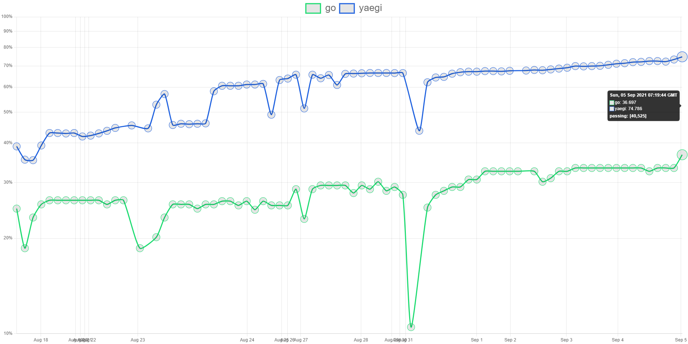

go2hx
==========
## Compile: Go -> Haxe -> C#, C++, Java, C/Hashlink

**warning:** *heavily experimental still a ways to go before an alpha.*

Come give feedback on what [Go libraries you want  supported!](https://github.com/go2hx/go2hx/issues/67)


# Getting started
* [Download Go 1.16+](https://golang.org/dl/)
* [Download Haxe 477663e nightly or later](https://build.haxe.org/builds/haxe/)

```
haxelib git go2hx https://github.com/go2hx/go2hx
```

Compile and run code with the interp target
```
haxelib run go2hx --interp ./main.go
```
Compile and generate build file with hashlink target
```
haxelib run go2hx --hxml build.hxml --norun --hl run.hl ./main.go
```

*Shows percentage of tests passing out of total*

<a href="https://go2hx.github.io/test883"></p></a>

# Language features

go2hx supports a subset of language features that have not been extensively tested yet. It does not include any support for go routines, The list includes:

* control flow statements for/if/range
* all statements except statements relating to go routines, control-flows/branches/decls
* all exprs conversion/literals/access

# Standard library support

The standard library that has been rewritten in Haxe has partial support, It does not include any support for unsafe, embeds, testing, and cgo, The most supported libraries in order includes:

* reflect
* fmt
* os
* strings
* strconv
* math

## Acknowledgement

A spiritual successor to Tardisgo written by [Elliott Stoneham](https://github.com/elliott5), The developer that has set the building blocks conceptually for this project, as well as a code contributor, with use of some of his code from Tardisgo.

## Build from source

```
haxelib dev go2hx .
```

Look at [Run.hx](./Run.hx) to see how the building occurs.