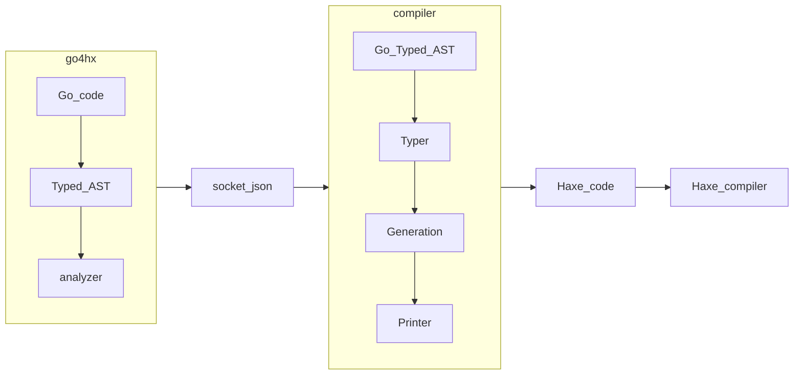

# go2hx [](https://github.com/go2hx/go2hx/actions/workflows/main.yml) [](https://github.com/go2hx/go2hx/) [](https://discord.gg/jgPcqC7DY2) [](https://github.com/go2hx/go2hx/)


Import Go libraries into your Haxe projects.

Spiritual successor to [Elliott Stoneham's compiler](#credits)

### March update on Youtube
[](https://www.youtube.com/watch?v=fzyGwSGyoRw)


If you are interested in improving the Haxe ecosystem you may be interested in [contributing](#contributing)

> [!WARNING]  
> Alpha version, not able to compile most Go code correctly

# Table of contents

- [Introduction](#introduction)
  - [Why Go for Haxe devs](#why-go-for-haxe-devs)
  - [Why Haxe for Go devs](#why-haxe-for-go-devs)
- [Getting started](#getting-started)
  - [Installation](#installation)
  - [First compile](#first-compile)
  - [Next steps](#next-steps)
- [Usage](#usage)
  - [How to use the stdlibs?](#how-to-use-the-stdlibs)
  - [Usage examples](#usage-examples)
- [Options](#options)
- [Project status](#project-status)
  - [Test status](#test-status)
  - [Goals](#goals)
  - [Known issues](#known-issues)
  - [Evaluating libraries](#evaluating-libraries)
  - [Upcoming](#upcoming)
- [Contributing](#contributing)
  - [Setup from source](#setup-from-source)
  - [Using the compiler development environment](#using-the-compiler-development-environment)
- [Similar Projects](#similar-projects)
- [Credits](#credits)

# Introduction

Compile [Go](https://go.dev) to [Haxe](https://haxe.org).

Use Haxe with it's promises up kept of a large library ecosystem with cross target support.
- No target lock in.
- Lots of maintained and well tested libraries to choose from.
- Built for Haxe devs needs such as native Haxe types and Haxe style naming convention.
- Simple to use, CLI default behavior covers 95% of use cases.


Precompiled libs are available with [no setup required](https://github.com/go2hx#working-haxelibs-precompiled).




# Why Go for Haxe devs
* Large library ecosystem >10 stars [Haxe 1k](https://github.com/search?q=stars%3A%3E10+language%3AHaxe&type=Repositories&ref=advsearch&l=Haxe&l=) vs [Go 73k](https://github.com/search?q=stars%3A%3E10+language%3AGo+&type=repositories&ref=advsearch) as of January 2025
* High quality code because of the Go language and builtin testing
* Interfacing with the compiled code is similar to interfacing with handwritten haxe code, examples: [unicode](https://github.com/go2hx/go2hx/blob/master/stdgo/unicode/Unicode.hx#L1751), [regexp/syntax](https://github.com/go2hx/go2hx/blob/master/stdgo/regexp/syntax/Syntax.hx#L633)
* Go and Haxe are both high level statically typed garbage collected languages
* Unlike externs, using Go code in Haxe, allows multiple Haxe targets to be used, no setup required.
# Why Haxe for Go devs
* Haxe is a stepping point to the jvm, c++, js etc
* Haxe allows your code and libraries to be used in non Go projects, growing the reach you can get.
* Haxe js target is a serious contender to Go wasm and gopherjs, with its dead code elimination and excellent transpiling support into js.

# Getting started

## Installation

* [Download Haxe 4.3.2+](https://build.haxe.org/builds/haxe/)


```sh
haxelib git go2hx https://github.com/go2hx/go2hx
```

### haxelib git too slow or does not work?

```sh
git clone --depth 1 https://github.com/go2hx/go2hx
haxelib dev go2hx go2hx
```
If you want updates, you can convert the shallow clone to an unshallow one:
```sh
cd go2hx
git fetch  --unshallow
```

## First compile

Start with something simple [unicode](https://pkg.go.dev/unicode) or [strings](https://pkg.go.dev/strings)

Run the tests:
```
haxelib run go2hx --test --interp unicode
```

All code compiled by default will be in `golibs` folder

The file to interface with the code from Haxe is `golibs/stdgo/unicode/Unicode.hx`

Include golibs folder in your hxml along with -lib go2hx for the init macro:
```hxml
-cp golibs
-lib go2hx
```
Then run an example such as:
```haxe
import stdgo.unicode.Unicode;

function main() {
    trace(Unicode.isGraphic('g'.code));
}
```

## Next steps

To go ahead with more complicated compiles, proceed with caution as most libraries will not work.
Feedback is highly welcome, and any issues run across feel free to make an issue.

Code using generics or unsafe has a very low chance of correctly compiling.
Likewise for non passing std libraries.

To experiment with a few samples take a look at: samples [code](https://github.com/go2hx/go2hx.github.io/tree/master/samples/cases) [live](https://go2hx.github.io/samples/)

If you have nodejs installed you can speed up compile times by adding the flag:
```sh
--compiler_nodejs
```

# Usage

To use go2hx command line tool, provide the following arguments.

```
haxelib run go2hx [options] pattern ...
```

Where pattern specifies one or more Go files, or directories containing Go
files. Go2hx can also run `go get` on your behalf so if you see documentation on a readme such as:
```sh
go get github.com/tidwall/btree
```
You can do:
```sh
haxelib run go2hx github.com/tidwall/btree
```

## How to use the stdlibs?

1. Look at the [website](https://go2hx.github.io/) for working stdlibs.
2. Follow the go2hx library install instructions above.
3. Add ``-lib go2hx`` to your hxml for openfl/haxeflixel users ``<haxelib name="go2hx" />``
4. prefix path to the stdlibs with ``stdgo``
5. Import for example unicode/utf8 ``import stdgo.unicode.utf8.Utf8``
6. Use function ``Utf8.runeCount``

## Usage examples

[go2hx website samples](https://github.com/go2hx/go2hx.github.io/tree/master/samples/cases)

You can see the status of stdlibs easily on the [website](https://go2hx.github.io/).

Code is by default added into ``golibs`` folder, this folder must be included to access the code.
Compiled go code into Haxe also relies on specific defines, and an init macro in ``extraParams.hxml`` this can be included either by add go2hx as a lib ``-lib go2hx`` or creating an ``hxml`` with the given params added in such as ``haxelib run go2hx unicode --hxml build.hxml``

Most of the compiled code will be in ``_internal/...`` this is intentional to hide the compiled code from Haxe devs and instead making the same paths without the ``_internal`` prefix the preferred method of access.

go2hx generates extern like files for all public fields, funcs, types etc. This allows Haxe devs to interact with code using normal Haxe types, rather then the special number abstracts to uphold the behavior of go, as well as strings, structs etc.

Some types however there is no Haxe equivalent such as interface{}/any, this is a type like Any but that can hold an extensive amount of type info about it's self, because of this when you want to create one you have to use a macro function, ``stdgo.Go.toInterface(x)`` likewise for go interfaces you must use ``stdgo.Go.asInterface``

Because of the nature of these types and the extern system, there is not the same level of testing as the behavior within ``_internal`` so please if you run into an issue with interfacing with compiled Go code, make an issue and most likely it can be resolved quickly!

This is a brief intro into usage, hopefully in the future, a lot of these details will become unnecessary and the usage will be more intuitive.


# Options

Go2hx supports the following command line options.

```sh
-norun              don't run the build commands
-nocomments         go test
-test               no comments
-output             set output path or file location
-root               set the root package for all generated files
-build              generate Haxe build file from compiler command
-hxml               generate build hxml from compiler commands
-printgocode        add go code as a comment to the generated Haxe code
-libwrap            all non main packages wrapped as a haxelib library

Target:
-cpp                generate C++ code into target directory
-js                 generate JavaScript code into target file
-jvm                generate JVM bytecode into target file
-python             generate Python code into target file
-lua                generate Lua code into target file
-cs                 generate C# code into target directory
-hl                 generate HashLink .hl bytecode or .c code into target file
-eval               interpret the program using internal macro system
-json               json data of tests
-failfast           Do not start new tests after the first test failure.
-short              Tell long-running tests to shorten their run time.
-timeout             If a test binary runs longer than duration d, panic. If d is 0, the timeout is disabled. The default is 10 minutes (10m).
-v                  Verbose output: log all tests as they are run. Also print all text from Log and Logf calls even if the test succeeds.
-nodeps             Remove all depedency on go2hx for the compiled code by moving the stdlib into the output
-version            Version of the compiler
```

# Project status

The project is currently in a prealpha state. Not able to compile most Go code. Most Go language features are extensively tested and will likely work in isolation, that are not explicated excluded such as: generics, unsafe

The project is on the verge of having larger 3rd party libraries working.
For example ``regexp/syntax`` now passes as well as [regexp2](https://github.com/dlclark/regexp2)

Lots of compiled code is on the verge of running correctly but has been put on hold in order to focus on the tests.

Other code requires adding code into ``src/Patch.hx`` to patch in code into the Haxe version of a Go stdlib.

## Test status
The project is driven by testing. Test suites are broken into categories for an [incremental approach](http://scheme2006.cs.uchicago.edu/11-ghuloum.pdf).

* Easy: are tests that use no stdlibs and exclude non supported language features.

* Medium: are tests with the same language feature constraints as easy, but allow passing stdlibs to be imported

* Hard: all other tests
*(hashlink only)*
- [Yaegi](https://github.com/traefik/yaegi/tree/master/_test) easy tests 100% passing
- Go easy 97.68% passing
- Yaegi medium 90.6% passing
- Go medium 78.94% passing

## Goals

Become the one stop shop for high quality Haxe libraries for Haxe devs

## Known issues

Beyond the known issues highlighted above, there are a handful of other issues
with using Go2hx.
- The compiler supports a sub-specification of the full language, language features outside of it, are likely excluded from testing and have no support.
- Many targets have fundamental problems not addressed by Go2hx such as too large of function blocks in jvm.
- The project has many rough spots, and pain points that need feedback to fix.
- Some of the excluded language features such as generics are heavily used in most Go libraries.
- Most stdlibs do not work, most 3rd party libs also do not work.


## Evaluating libraries

There is the language and then the stdlib.

If a library uses language features not supported such as [generics](https://go.dev/blog/intro-generics), [unsafe](https://pkg.go.dev/unsafe) or [cgo](https://go.dev/blog/cgo), it will most likely not work.

generics by: ``[T`` (not fully reliable)

unsafe by: ``unsafe``

Next are stdlibs, you can find all of the given stdlibs for any 3rd party or stdlib by using [pkg.go.dev](https://pkg.go.dev)

I often do ``pkg.go.dev`` **/** github.com/user/repo

for example: [pkg.go.dev/github.com/itchio/lzma](https://pkg.go.dev/github.com/itchio/lzma)

Next I find the tab called ``imports: X`` (X being the amount of imports) click on it and it will show you the [imports fot the projects](https://pkg.go.dev/github.com/alecthomas/chroma/v2?tab=imports).

Libraries with only stdlibs are ideal, but a small amount of 3rd party libs can also work if they follow the same positive evaluation of language and lib usage denoted here.

 
 
The most likely not to work library is ``net/http`` because of its sheer complexity, pulling in a massive 46 stdlibs as well as 4 quasi 3rd party libs.


On the other hand `syscalls`` is way to lowlevel and highly unsupported.

After that ``encoding/`` will also likely not working because of not enough ``reflect`` support.

Fmt will likely work along with the 19+ stdlibs currently passing their tests: [check them on the website](https://go2hx.github.io/)

``os``, ``reflect`` are mixed, some things work and others not so much.

``slices`` will not work, because it's a new stdlib using all generics.

``io`` does not work, because of a strange bug of a missing type.


## Upcoming
(roadmap)

Besides addressing the various limitations and issues we've already mentioned,
we have a number of features planned for Go2hx.

- go-easy, go-medium, and yaegi-medium 100% passing tests on hashlink
- ~~Get the [chroma](https://github.com/alecthomas/chroma) library compiling and working~~ (requires encoding/xml and embed pkg, lowered in priority)
- Compile and release: [Lzma](https://github.com/itchio/lzma) compression library 
- Compile and release: [hsm](https://github.com/dragomit/hsm) hierarchical state machine library
- More std libs passing
- [Dog fooding](https://en.wikipedia.org/wiki/Eating_your_own_dog_food): use [go-humanize](https://github.com/dustin/go-humanize), [bubbletea](https://github.com/charmbracelet/bubbletea)

# Contributing

A decent familiarity with Go will seriously help.
If you look at `./rnd/main.go` you can modify that file and then run 
```sh
haxe rnd/rnd.hxml -D interp_
```
It will run both Go2hx and Go and allow you to see the difference.
I use this tool daily and almost all problems I run into, I isolate the problem from a bigger piece of Go code, run it in rnd, see the issue, create a unit test, and then make changes to the compiler until it works properly.

## Setup from source


```sh
git clone https://github.com/go2hx/go2hx
cd go2hx
haxelib dev go2hx go2hx
haxe --run Run build
```
Now you can run the compiler, for example on a go test file:
```sh
haxelib run go2hx ./main.go --rebuild
```


> [!TIP]
> Use the --rebuild command to have the compiler build every time it is called, useful when making active changes to the compiler and testing it by running it.

## Using the compiler development environment

After you have [setup from source](#setup-from-source) and **ran the compiler at least once** you should be able to use the dev tools, here is the list and how they work.

* ``haxe rnd.hxml`` : rnd stands for research and development, it's a quirky name for a test bed that runs ``./rnd/main.go`` use it for rapid testing of go snippets and comparison with go output.
* ``haxe extra/scripts/stdgo.hxml`` : (requires nodejs) go's standard library generator, all std pkgs compiled are added into ``./stdgo/*`` for generating specific std go libs use the ``-D libs`` flag. For example to compile ``unicode/utf8`` and ``strings`` run: ``haxe extra/scripts/stdgo.hxml -D libs=unicode/utf8,strings``

* ``haxe tests/tests.hl [suite]`` : ([requires hashlink](https://hashlink.haxe.org/#download)) and nodejs A multi suite test runner with a built in regression tracker, used primarily by github actions to test for progression and regression of every commit to the project. [suite] can be any of the following added as an argument: unit, stdgo, yaegi, gobyexample, go . For example ``haxe tests/tests.hxml -D std``

* ``haxe stdgo/[std].hxml --[target]`` : A series of hxml files created by running the stdgo test suite. Every stdlib listed in ``./tests.json`` has an hxml file created at ``./stdgo`` root folder. For example to run ``unicode/utf16`` with the ``interp`` target : ``haxe stdgo/unicode_utf16.hxml --interp``

# Similar Projects

- [tardisgo](https://github.com/tardisgo/tardisgo) go to haxe compiler that this project is the spiritual successor to
- [gopherjs](https://github.com/gopherjs/gopherjs) go to js compiler
- [reflaxe_go](https://github.com/neimanpinchas/reflaxe_go) is a go target for haxe

# Credits

A spiritual successor to Tardisgo written by [Elliott Stoneham](https://github.com/elliott5),
A maintainer, mentor, and code contributor of this project. Elliott's wise counsel, solid engineering design, and effective programming is the core of this project and go2hx would not exist without him.